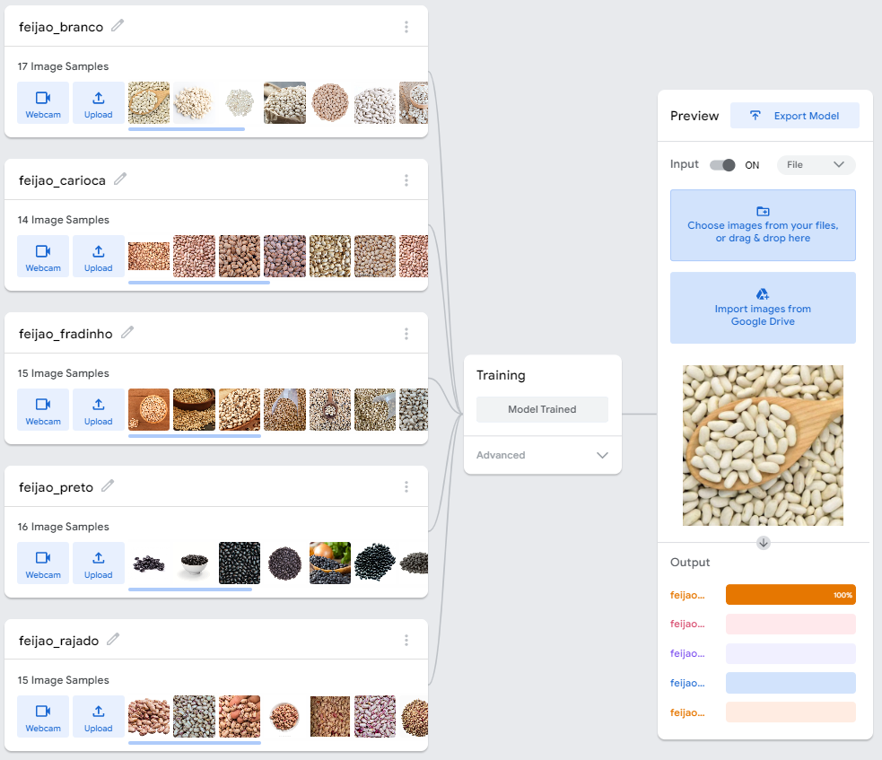
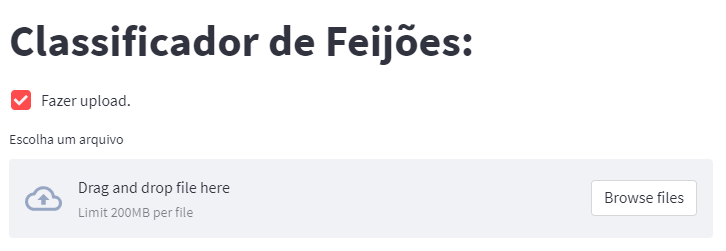
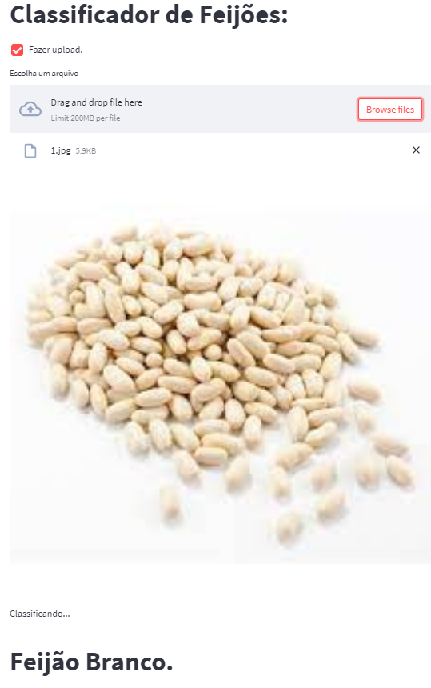

# Red Hot Chili Beans

Red Hot Chili Beans é um aplicativo rodando na nuvem utilizando a a biblioteca [Streamlit](https://streamlit.io/) (Python) para rodar um modelo de classificação de imagens utilizando o o [Teachable Machine do Google](https://teachablemachine.withgoogle.com/). 

## Para acessá-lo [Clique aqui](link streamlit). 

-----

Este é um MVP para um futuro classificador de grãos. 
O Brasil é o 4° maior produtor de grãos no mundo, porém o método de classificação, assim como grande parte da produção agrícola do país, usa pouca tecnologia, sendo pouco automatizado e depende de mão de obra. 
O Brasil exportou em 2021 86,628 milhões de toneladas de soja em grão, 5,2% mais que no ano anterior. 

Se houvesse uma AgriTech que inventasse um classificador de grãos automatizado, atingisse 20% do mercado de exportação de soja (apenas soja) e cobra-se 0,50 centavos por saca (60kg) de soja classificada, teria um faturamento de R$144.380.000 apenas em 2021. 

São mais de 13 classes e subtipos de feijão, porém para este **MVP** nós treinamos apenas 5 classes, sendo elas:

* 01.Feijão branco
* 02.Feijao carioca
* 03.Feijao fradinho
* 04.Feijao preto
* 05.Feijao rajado

A ideia é nesse aplicativo é que o usuário possa acessar pelo celular, tablet, computador e realizar o upload da foto do feijão que deseja classificar.

Depois do upload, o modelo irá rodar e classificar qual o tipo de feijão está presente na foto.

---

# **ATENÇÃO:**

* Este modelo foi treinado com fotos aleatórias da internet. Ele não vai estar performando no melhor desempenho possível pois foi utilizado uma base de treino fraca. **Garbage in - Garbage out**.

* Este projeto é uma brincadeira apenas para validar a idéia e unir a biblioteca Streamlit com o TeachAble Machine

